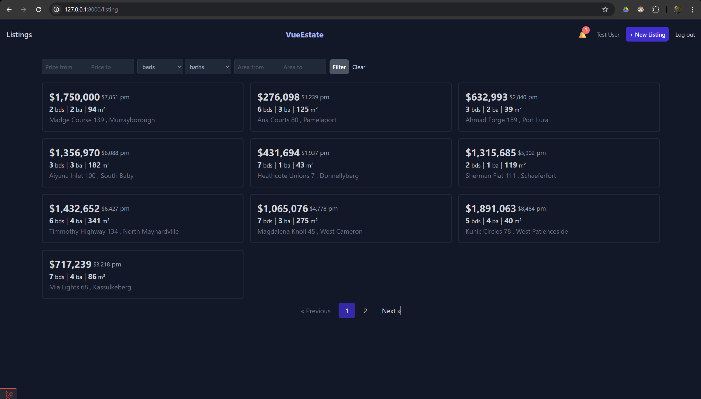

# 📝 TaskFlow: Simple Task Management

## App Screenshot

<p align="center">
  
</p>

<h1 align="center" style="color: #FF5733; font-size: 28px;">
  📹 APPLICATION DEMONSTRATION VIDEO
</h1>

<h2 align="center">
  <a href="https://drive.google.com/file/d/1qZUZndKTXNBng-ayyHfXd982rPR59eIV/view?usp=sharing" 
     style="font-size: 22px; color: #2874A6; text-decoration: underline;">
    ▶️ WATCH THE WORKING APP DEMO VIDEO ◀️
  </a>
</h2>

<div align="center" style="background: #FFF3CD; padding: 10px; border-left: 4px solid #FFC107; margin: 15px 0;">
  <strong>ℹ️ Important:</strong> This is a <span style="color: #D35400;">video recording</span> showing the app's functionality,
</div>

A sleek Vue.js application for buying and selling properties with powerful search and intuitive property management.


✨ **Why VueState?**
- 🏡 Comprehensive property listings with rich details
- 🔍 Advanced search and filtering
- 💰 Instant price comparisons
- 📱 Responsive design for all devices
- 🔐 Secure transaction system

## 🛠️ Installation Guide

### 📋 Prerequisites
- PHP 8.1+
- Composer 2.0+
- Node.js 16+
- MySQL 8.0+ (or Docker)
- NPM/Yarn

### ⚙️ Environment Configuration

1. Copy the environment template:

   
   Create file name .env 
   then copy the .env.example to .env file
   

🧰 Dependency Installation
# Install PHP dependencies

```bash
composer install
```
# Install JavaScript dependencies

```cmd
 npm install
```
🗃️ Database Setup

Using Docker (Recommended)
bash

Ensure that docker installed and running then run

```bash
docker compose up 
```


Create a database named VueState

Update your .env with correct credentials

🌐 Access the Adminer DB at: http://localhost:8080/

Choose :-

System : MySQL / MariaDB 

Server : MySQL 

Username : root 

password : root

Run migrations:
```bash
php artisan migrate --seed
```

🚦 Running the Application
Start the development servers in two separate terminals:

Backend Server:

```bash
php artisan serve
```

Frontend Assets:

```bash
npm run dev
```

🌐 Access the application at: http://localhost:8000

🌐 Access the mailhog at: http://localhost:8025/#

🚨 Troubleshooting
Issue	Solution
Database connection errors	Verify MySQL service is running
Asset compilation issues	Run npm run build
Permission errors	Run chmod -R 775 storage bootstrap/cache
Missing APP_KEY	Run php artisan key:generate

🌟 Features

✔️ Property listings with high-quality images

✔️ Interactive map view

✔️ Favorites system

✔️ Seller dashboard

✔️ Beautiful task management interface

✔️ Smooth animations and transitions

✔️ Responsive design

✔️ Database persistence
